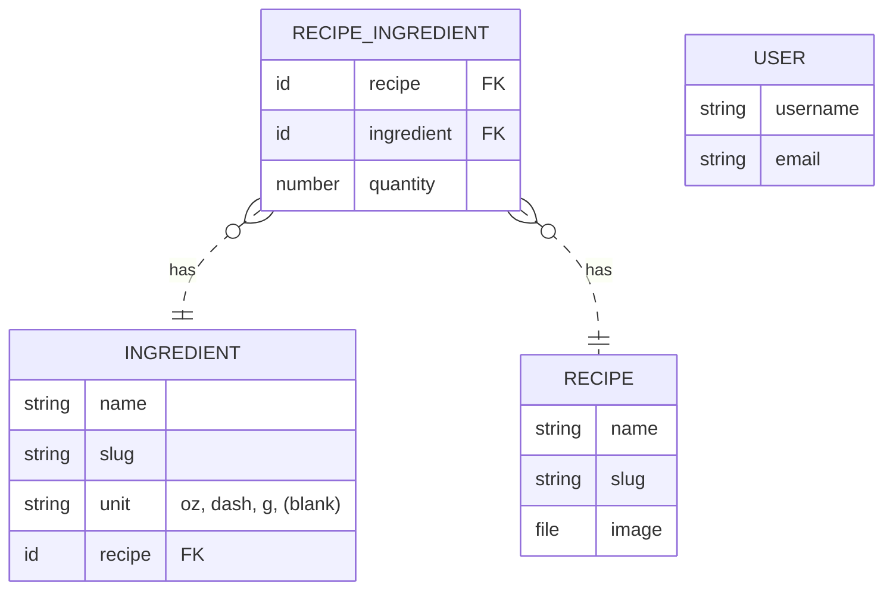

# misebar v0.1.5

## :computer: Stack

- Front-end: [SvelteKit](https://kit.svelte.dev/)
- Back-end: [PocketBase](https://pocketbase.io/)
- UI: [skeleton.dev](https://www.skeleton.dev/) / [iconify](https://iconify.design/)
- Testing: [Vitest](https://vitest.dev/) / [Playwright](https://playwright.dev/)

## Data Structure

## :construction: Under Development

- [ ] @dan: it took a second to figure out there is no automatic filter that just shows available recipes based on the checked ingredients. Intuitively, that's what I was expecting before reading your email in completion.
- [ ] @dan: Dark, moody, sexy. It aligns in my brain with the thought of a cocktail. I think that the vertical list style works well for mobile interface, but there is room horizontally for columns on the web browser view
- [ ] @dan: It would be much more helpful if there were a wider base of recipes from which to choose.
- [ ] @dan: Highlighting the possible recipes that all the ingredients are there for is good. Adding a stoplight system where green denotes you have everything, yellow means you are missing one ingredient etc. would be helpful. Like oh, I only need one more thing for a Last Word, I'll check it out.
- [ ] @dan: Also, estimated % alcohol would be cool
- [ ] @jeff: It recommends recipes where I have none of the ingredients, not sure if that's intentional to make me feel like I'm better stocked than I am.
- [ ] @jeff: On that note, maybe a shopping list based on missing ingredients?
- [ ] @jeff: Perhaps some photos as well? 
- [ ] @jeff: I appreciate that you don't have a hidden a 'jump to recipe' button and make me read thorough 10 paragraphs of the history of each recipe aha, though maybe the cocktail stories would be a nice addition. 
- [ ] feat: @kate when you tap the user icon from account page, takes you back to home page
- [ ] feat: user ability to edit ingredients/recipes that they own
- [ ] feat: similar recipes field on 'recipes' (and links to others on slug page)
- [ ] feat: recipe tags for better searching
- [ ] feat: `/ingredients/[slug]` page for recipes containing [slug]
- [ ] feat: display thumbnail of image when creating recipe
- [ ] feat: be able to delete ingredient lines if too many added (add/remove)
- [ ] feat: add ingredients right from new recipe page.
- [ ] feat: remove unecessary styles (margin, color)
- [ ] feat: lastLoggedIn field on users collection (for tracking app activity)

## :arrows_counterclockwise: Changelog

- started development 2023 [mise](https://github.com/kylehorton33/svelte-bar)
- [0.1.0](/CHANGELOG.md#010) [0.1.1](/CHANGELOG.md#011) [0.1.2](/CHANGELOG.md#012) [0.1.3](/CHANGELOG.md#013) [0.1.4](/CHANGELOG.md#014)