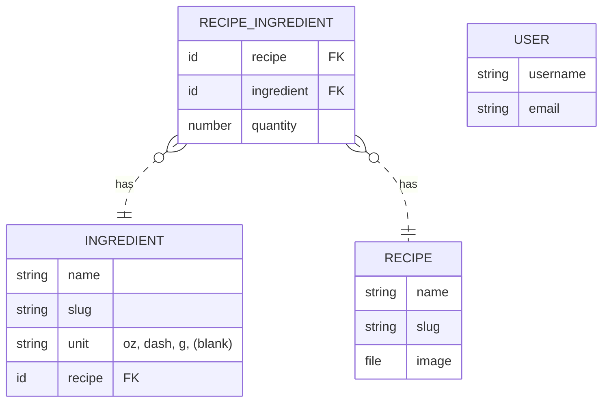

# misebar v0.1.4

## :computer: Stack

- Front-end: [SvelteKit](https://kit.svelte.dev/)
- Back-end: [PocketBase](https://pocketbase.io/)
- UI: [skeleton.dev](https://www.skeleton.dev/) / [iconify](https://iconify.design/)
- Testing: [Vitest](https://vitest.dev/) / [Playwright](https://playwright.dev/)

## Data Structure

## :construction: Under Development

- [ ] @jeff: It recommends recipes where I have none of the ingredients, not sure if that's intentional to make me feel like I'm better stocked than I am.
- [x] feat: replace number on RecipeCard with checkmark
- [ ] @jeff: On that note, maybe a shopping list based on missing ingredients?
- [ ] @jeff: Perhaps some photos as well? 
- [ ] @jeff: Viewed on an android in dark theme, perhaps the missing vs in stock ingredients could be a bit more clear of a distinction. 
- [ ] @jeff: I appreciate that you don't have a hidden a 'jump to recipe' button and make me read thorough 10 paragraphs of the history of each recipe aha, though maybe the cocktail stories would be a nice addition. 
- [ ] feat: @kate when you tap the user icon from account page, takes you back to home page
- [x] feat: add index field to recipeIngredients for better ordering
- [x] test: add more tests/environment for database/auth testing
- [x] test: add testing env to vercel `dev` branch
- [ ] feat: user ability to edit ingredients/recipes that they own
- [ ] feat: similar recipes field on 'recipes' (and links to others on slug page)
- [ ] feat: recipe tags for better searching
- [ ] feat: `/ingredients/[slug]` page for recipes containing [slug]
- [ ] feat: display thumbnail of image when creating recipe
- [ ] feat: be able to delete ingredient lines if too many added (add/remove)
- [ ] feat: add ingredients right from new recipe page.
- [ ] feat: remove unecessary styles (margin, color)

## :arrows_counterclockwise: Changelog

- started development 2023 [mise](https://github.com/kylehorton33/svelte-bar)
- [0.1.0](/CHANGELOG.md#010) [0.1.1](/CHANGELOG.md#011) [0.1.2](/CHANGELOG.md#012) [0.1.3](/CHANGELOG.md#013) [0.1.4](/CHANGELOG.md#014)